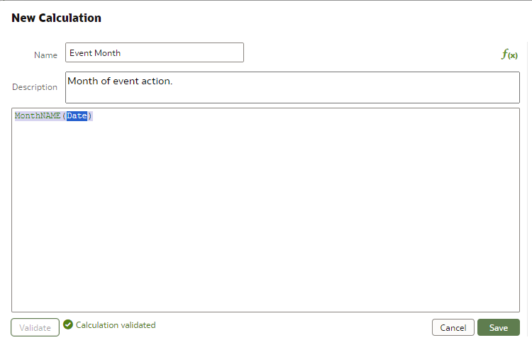
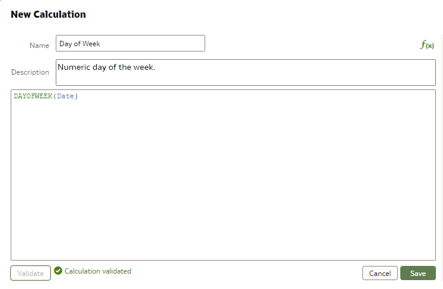
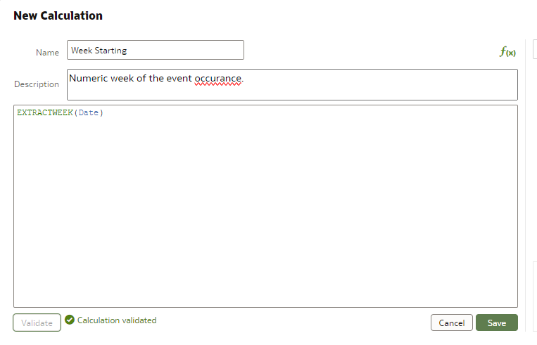

# How to Develop a Calendar Report in Oracle Data Visualizer

## Introduction

Coming soon WIP ! In the current release of OAC the ability to do calendar based vizualizations is very limited. The only option at the time of this recording was to leverage the Calendar Heat Map Custom Vizualization which for my purpose was not the best option. During this tutoriol we will showcase how to modify DV lists so that they build a make shift calendar of information items per day of the month. 

We'll show you

* Import a sample data set
* Create custom calculations on a date field.
* Leverage the List Vizualization to create a calendar display. 

Please watch this first. Only the basic instructions and sample code will be provided below, the core guidance is inside the video itself. 
[How to Develop a Calendar Report in Oracle Data Visualizer](youtube:xxxxxxx)

## Task 1: Open DV and Upload the Sample Data Set


1.  Download the sample data set to your local machine. 

The sample csv file below can be found at: [Sample Data CSV] (https://raw.githubusercontent.com/chipbaber/tips_tricks_howtos/refs/heads/main/analytics/calendar_rpt/files/sample.csv)


## Task 2: Develop the Following Calculations

The calculations are needed to construct the calendar list view. In some cases the calculation will be created for you on .csv upload, however if you are leveraging a restricted data set I will include the examples for all. 

1. Create the Month column calculation.
    ```
    MonthNAME(Date)
    
    ```
 

   Create the muneric day of the week calc. 

    ```
   DAYOFWEEK(Date)
    ```


  Create the alphabetical day of the week calc. 
  ```
  DAYNAME(Date)
  ```

   Create the interaction week starting calculation.
  ```
  EXTRACTWEEK(Date)
  ``` 
  

  2. Set the date format in the list report. 

  ```
  MMM DD: 
  ```
    

## Acknowledgements
  * **Authors:** Chip Baber, Director Cloud Engineering, Oracle Code Innovate
  * **Last Updated By/Date:** Chip Baber, Sept 18, 2024

Copyright (C)  Oracle Corporation.

Permission is granted to copy, distribute and/or modify this document
under the terms of the GNU Free Documentation License, Version 1.3
or any later version published by the Free Software Foundation;
with no Invariant Sections, no Front-Cover Texts, and no Back-Cover Texts.
A copy of the license is included in the section entitled [GNU Free Documentation License](files/gnu-free-documentation-license.txt)